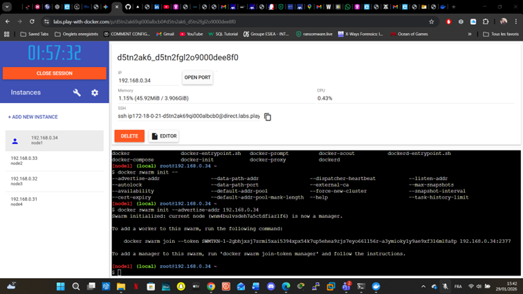
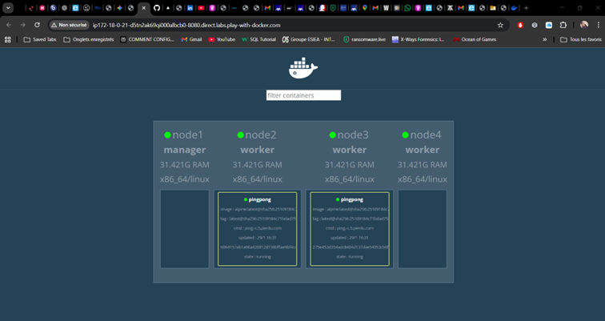
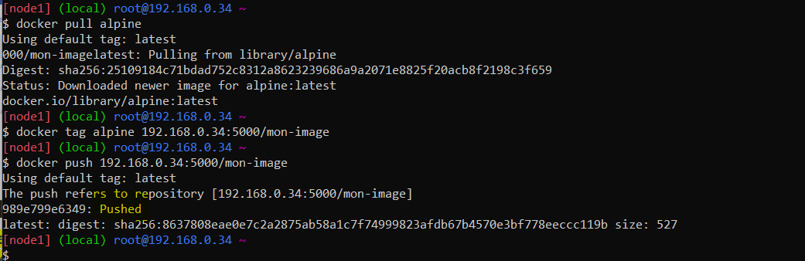
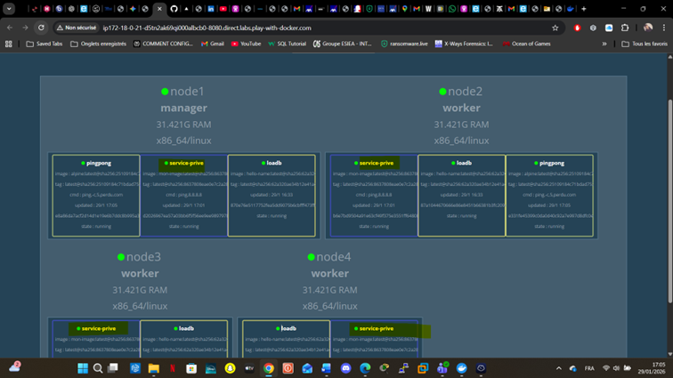

# 🐳 Compte-Rendu TP Docker Swarm - Orchestration de Cluster


Ce projet documente la mise en place d'un cluster orchestré avec Docker Swarm. L'infrastructure est composée de 4 instances Linux simulant un environnement de production distribué.

## 📋 Guide Technique Pas à Pas

### 1️⃣ Mise en place du Cluster (Exercice 1)
L'objectif est d'initialiser le mode Swarm sur le manager et de fédérer les 3 workers pour former le cluster.

<details>
<summary>💻 Voir les commandes terminal</summary>

**Sur le Node 1 (Manager) :**
* Initialisation du cluster :
    ```bash
    docker swarm init --advertise-addr 192.168.0.34
    ```
* Vérification de l'état du cluster :
    ```bash
    docker node ls
    ```
</details>



---

### 2️⃣ Réplication & Visualisation (Exercice 2)
Mise en place d'un outil de monitoring graphique et test de la haute disponibilité (self-healing).

<details>
<summary>💻 Voir les commandes terminal</summary>

**Sur le Node 1 :**
* Lancer le Visualizer en mode standalone sur le port 8080 :
    ```bash
    docker run -d -p 8080:8080 -v /var/run/docker.sock:/var/run/docker.sock dockersamples/visualizer
    ```
* Créer un service de 2 réplicas (image alpine) :
    ```bash
    docker service create --name pingpong --replicas 2 -d alpine ping -c 5 perdu.com
    ```
</details>



---

### 3️⃣ Load Balancing (Exercice 3)
Déploiement d'un service web réparti pour tester l'équilibrage de charge natif via le port 80.

<details>
<summary>💻 Voir les commandes terminal</summary>

**Sur le Node 1 :**
* Déploiement du service `loadb` avec 4 réplicas :
    ```bash
    docker service create --name loadb --replicas 4 -p 80:80 flointech/hello-name
    ```

**Vérification :**
* L'accès au port 80 retourne l'ID du conteneur. En rafraîchissant la page, l'ID change, prouvant la répartition du trafic.
</details>


---

### 4️⃣ Registry Privé & Déploiement Local (Exercice 4)
Configuration d'un magasin d'images interne pour sécuriser et centraliser les déploiements.

<details>
<summary>💻 Voir les commandes terminal</summary>

**Sur CHAQUE Node (1, 2, 3, 4) :**
* Configurer les `insecure-registries` dans `/etc/docker/daemon.json` :
    ```json
    { "insecure-registries": ["127.0.0.1", "192.168.0.34:5000"] }
    ```
* Recharger la configuration : `kill -HUP $(pidof dockerd)`

**Sur le Node 1 (Push et Création) :**
* Pousser l'image vers le registry local :
    ```bash
    docker pull alpine
    docker tag alpine 192.168.0.34:5000/mon-image
    docker push 192.168.0.34:5000/mon-image
    ```
* Créer le service final à partir de l'image privée :
    ```bash
    docker service create --name service-prive --replicas 4 192.168.0.34:5000/mon-image ping 8.8.8.8
    ```
</details>



---

## 🖼️ Résultat Final
Vue d'ensemble du cluster via le **Visualizer** montrant la coexistence et la répartition des services sur les 4 nœuds.



## 🏁 Conclusion
Ce TP a validé les capacités de Docker Swarm en termes de **haute disponibilité**, de **load balancing** automatique et de gestion de **registre privé**.
